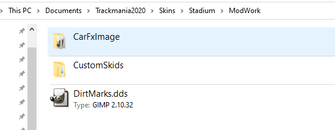
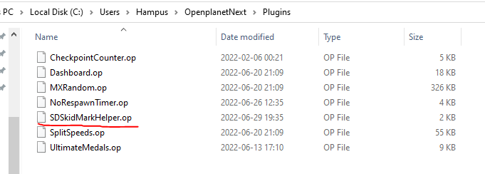

 - Go to the ModWork folder `C:\Users\<USER>\Documents\Trackmania2020\Skins\Stadium\ModWork`
   - If it doesn't exist, create it.
      - If Trackmania was running it needs a restart.
 - Put the `CustomSkids` folder in the `ModWork` folder .

The plugin swaps these around depending on your speed and drift, if you have old custom skids, you can put them in `DefaultSkids` or backup/delete them. 
The plugin should delete any existing if they are left there.

Put the `SDSkidMarkHelper.op` file in your in your plugins folder, which should be `C:\Users\<USER>\OpenplanetNext\Plugins` .

You should now be ready to go.

https://www.youtube.com/watch?v=EqJnW2aKB7c youtube video showing the plugin in use.